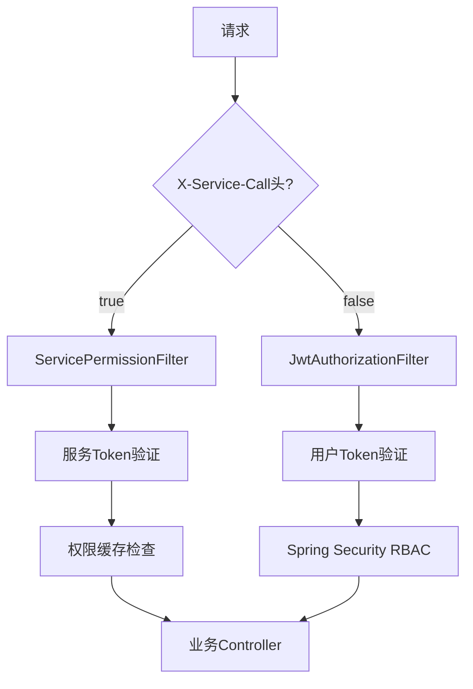

#  admin管理系统 - 服务间调用权限管理 + API接口自动扫描

> **完整的微服务权限管理解决方案**  
> 集成了服务间调用Token签发、权限验证、API接口自动发现和管理等核心功能

[](https://spring.io/projects/spring-boot)
[](https://www.mysql.com/)
[](https://jwt.io/)
[](LICENSE)

## 📋 目录

- [🎯 系统概述](#-系统概述)
- [✨ 核心功能](#-核心功能)
- [🏗️ 系统架构](#️-系统架构)
- [⚡ 快速开始](#-快速开始)
- [🔧 配置说明](#-配置说明)
- [📖 API文档](#-api文档)
- [🔍 使用示例](#-使用示例)
- [🛠️ 开发指南](#️-开发指南)
- [🚨 故障排查](#-故障排查)
- [📈 性能优化](#-性能优化)
- [🤝 贡献指南](#-贡献指南)

## 🎯 系统概述

本系统是一个为微服务架构设计的**完整权限管理解决方案**，包含两大核心模块：

### 🛡️ 服务间调用权限管理
- **服务应用注册**：管理微服务应用的注册和授权
- **Token签发**：为服务间调用提供永久JWT Token
- **权限验证**：高性能的接口访问权限控制
- **缓存机制**：基于内存的权限缓存，毫秒级响应

### 🔍 API接口自动扫描管理
- **自动发现**：启动时自动扫描所有Controller接口
- **智能解析**：解析路径、方法、描述等详细信息
- **统一管理**：提供完整的接口查询、搜索、分组功能
- **实时监控**：支持手动刷新和强制重新扫描

## ✨ 核心功能

### 🔐 双重认证机制



### 🚀 功能特性

| 特性 | 服务调用 | 用户调用 |
|------|----------|----------|
| **认证方式** | 服务Token (永久) | 用户Token (8小时) |
| **权限验证** | 接口权限列表 | Spring Security RBAC |
| **响应速度** | 毫秒级缓存 | 数据库查询 |
| **适用场景** | 微服务间通信 | 前端用户操作 |

## 🏗️ 系统架构

```
┌─────────────────────────────────────────────────────────────┐
│                      管理系统架构                          │
├─────────────────────────────────────────────────────────────┤
│  前端层：Web UI + Mobile App                                │
├─────────────────────────────────────────────────────────────┤
│  网关层：Spring Cloud Gateway + Load Balancer              │
├─────────────────────────────────────────────────────────────┤
│  安全层：JWT Auth + Service Permission Filter               │
├─────────────────────────────────────────────────────────────┤
│  业务层：                                                    │
│  ┌─────────────┬─────────────┬─────────────┬─────────────┐  │
│  │ 服务管理     │ 权限管理     │ API管理     │ 业务模块     │  │
│  │ Service App │ Permission  │ Endpoints   │ Hospital    │  │
│  └─────────────┴─────────────┴─────────────┴─────────────┘  │
├─────────────────────────────────────────────────────────────┤
│  数据层：MySQL + Redis Cache                               │
└─────────────────────────────────────────────────────────────┘
```

### 📁 项目结构

```
zxy-admin/
├── server/                     # 启动模块
│   ├── src/main/java/com/main/
│   │   ├── MainApplication.java # 主启动类
│   │   └── config/             # 全局配置
│   └── src/main/resources/     # 配置文件
├── security/                   # 安全模块
│   ├── entity/                 # 实体类
│   │   ├── ServiceAppEntity.java
│   │   ├── ServiceTokenEntity.java
│   │   └── ApiEndpointEntity.java
│   ├── mapper/                 # 数据访问层
│   ├── service/                # 业务逻辑层
│   ├── controller/             # 控制器层
│   ├── filter/                 # 过滤器
│   │   ├── JwtAuthorizationFilter.java
│   │   └── ServicePermissionFilter.java
│   └── config/                 # 配置类
├── common/                     # 公共模块
├── pojo/                       # 数据对象
└── complete_database.sql       # 完整数据库脚本
```

## ⚡ 快速开始

### 1. 环境要求

| 组件 | 版本要求 | 说明 |
|------|----------|------|
| **JDK** | 8+ | 推荐使用JDK 11 |
| **MySQL** | 8.0+ | 支持JSON字段 |
| **Maven** | 3.6+ | 依赖管理 |
| **Redis** | 6.0+ | 可选，用于缓存 |
自带的管理界面（未完善）
http://localhost:8080/admin/login

### 2. 数据库初始化

```bash
# 连接MySQL并执行脚本
mysql -u root -p123456 < complete_database.sql
```

### 3. 配置文件

```yaml
# application-dev.yml
spring:
  datasource:
    driver-class-name: com.mysql.cj.jdbc.Driver
    url: jdbc:mysql://localhost:3306/zxy_hospital?useSSL=false&serverTimezone=UTC
    username: root
    password: 123456
    hikari:
      minimum-idle: 5
      maximum-pool-size: 20
      connection-timeout: 30000

# JWT配置
security:
  jwt:
    secret-key: nangtongcourtjj1001001
    ttl: 28800000  # 8小时
    head-name: Authorization
    head-base: "Bearer "
  
  # 权限白名单
  permit-all:
    - "/login"
    - "/doc.html"
    - "/swagger-ui/**"
```

### 4. 启动应用

```bash
# 编译项目
mvn clean compile -DskipTests

# 启动应用
mvn spring-boot:run -pl server
```

### 5. 验证启动

启动成功后，你应该看到类似的日志：

```
🔄 开始初始化权限缓存... (尝试 1/3)
✅ 权限缓存初始化成功
🚀 应用启动完成，开始自动扫描API接口...
📊 扫描结果：新增 25 个接口，耗时 150 ms
✅ API接口自动扫描完成！
```

## 🔧 配置说明

### 数据库连接配置

```yaml
spring:
  datasource:
    hikari:
      minimum-idle: 5                # 最小空闲连接
      maximum-pool-size: 20          # 最大连接数
      idle-timeout: 30000            # 空闲超时(30秒)
      max-lifetime: 1800000          # 连接最大生存时间(30分钟)
      connection-timeout: 30000      # 连接超时(30秒)
      connection-test-query: SELECT 1 # 连接测试查询
```

### 安全配置

```yaml
security:
  # 权限白名单
  permit-all:
    - "/login"           # 登录接口
    - "/doc.html"        # API文档
    - "/swagger-ui/**"   # Swagger UI
    - "/v3/api-docs/**"  # OpenAPI文档
  
  # 基于角色的访问控制
  role-based:
    - pattern: "/admin/**"
      role: ADMIN
    - pattern: "/manager/**"
      role: MANAGER
```

## 📖 API文档

### 🔐 服务应用管理

#### 注册服务应用
```http
POST /api/service-app/register
Authorization: Bearer {admin_token}
Content-Type: application/json

{
    "appName": "测试服务",
    "allowedApis": ["/api/test/**", "/api/user/**"],
    "createBy": "admin",
    "remark": "测试用服务应用"
}
```

**响应**：
```json
{
    "code": 200,
    "msg": "success",
    "data": {
        "id": 713021225472069,
        "appName": "测试服务",
        "appId": "713021225472069",
        "authCode": "WsrAHKbqzqloYYudW_lTmJnszxG4L3G1",
        "allowedApiList": ["/api/test/**", "/api/user/**"],
        "status": 1,
        "createTime": "2025-01-27T10:30:00"
    }
}
```

#### 查询服务应用列表
```http
GET /api/service-app/list?page=1&size=10&keyword=测试
Authorization: Bearer {admin_token}
```

### 🎫 服务Token管理

#### 签发服务Token
```http
POST /api/service-token/issue
Content-Type: application/json

{
    "appId": "713021225472069",
    "authCode": "WsrAHKbqzqloYYudW_lTmJnszxG4L3G1",
    "issueBy": "admin"
}
```

**响应**：
```json
{
    "code": 200,
    "msg": "success",
    "data": {
        "id": 713021225472070,
        "appId": "713021225472069",
        "token": "eyJ0eXAiOiJKV1QiLCJhbGciOiJIUzI1NiJ9...",
        "tokenType": "permanent",
        "issueTime": "2025-01-27T10:30:00",
        "isValid": 1
    }
}
```

### 🔍 API接口管理

#### 分页查询接口
```http
GET /api/endpoints/page?page=1&size=20&keyword=test&moduleGroup=测试接口
```

#### 搜索接口
```http
GET /api/endpoints/search?keyword=权限&page=1&size=10
```

#### 手动扫描新接口
```http
POST /api/endpoints/scan
Authorization: Bearer {admin_token}
```

### 💾 权限缓存管理

#### 初始化权限缓存
```http
POST /api/permission-cache/init
Authorization: Bearer {admin_token}
```

#### 刷新应用权限
```http
POST /api/permission-cache/refresh/713021225472069
Authorization: Bearer {admin_token}
```

## 🔍 使用示例

### 服务间调用示例

#### 1. 用户调用（前端 → 后端）
```bash
curl -X GET "http://localhost:8080/api/service-app/list" \
     -H "Authorization: Bearer {用户Token}"
```

#### 2. 服务间调用（微服务 → 微服务）
```bash
curl -X GET "http://localhost:8080/api/test/example" \
     -H "X-Service-Call: true" \
     -H "appid: 713021225472069" \
     -H "Authorization: Bearer {服务Token}"
```

### 完整的业务流程

#### 1. 注册新服务
```bash
# 1) 注册服务应用
curl -X POST "http://localhost:8080/api/service-app/register" \
     -H "Authorization: Bearer {admin_token}" \
     -H "Content-Type: application/json" \
     -d '{
       "appName": "订单服务",
       "allowedApis": ["/api/order/**", "/api/payment/**"],
       "createBy": "admin"
     }'

# 2) 签发服务Token
curl -X POST "http://localhost:8080/api/service-token/issue" \
     -H "Content-Type: application/json" \
     -d '{
       "appId": "{返回的appId}",
       "authCode": "{返回的authCode}",
       "issueBy": "admin"
     }'

# 3) 刷新权限缓存
curl -X POST "http://localhost:8080/api/permission-cache/refresh/{appId}" \
     -H "Authorization: Bearer {admin_token}"
```

#### 2. 服务调用
```bash
# 使用服务Token调用接口
curl -X POST "http://localhost:8080/api/order/create" \
     -H "X-Service-Call: true" \
     -H "appid: {appId}" \
     -H "Authorization: Bearer {service_token}" \
     -H "Content-Type: application/json" \
     -d '{"productId": 123, "quantity": 2}'
```

## 🛠️ 开发指南

### 添加新的业务接口

#### 1. 创建Controller
```java
@Api(tags = "订单管理")
@RestController
@RequestMapping("/api/order")
public class OrderController {
    
    @ApiOperation("创建订单")
    @PostMapping("/create")
    public Result<Order> createOrder(@RequestBody OrderDTO orderDTO) {
        // 业务逻辑
        return Result.success(order);
    }
}
```

#### 2. 自动扫描
系统启动时会自动扫描新接口，或手动触发：
```bash
curl -X POST "http://localhost:8080/api/endpoints/scan" \
     -H "Authorization: Bearer {admin_token}"
```

#### 3. 配置权限
```bash
# 更新服务应用的允许接口列表
curl -X PUT "http://localhost:8080/api/service-app/update" \
     -H "Authorization: Bearer {admin_token}" \
     -H "Content-Type: application/json" \
     -d '{
       "id": 123,
       "allowedApis": ["/api/order/**", "/api/payment/**"],
       "updateBy": "admin"
     }'
```

### 权限控制最佳实践

#### 1. 接口权限设计
```java
// 管理员专用接口
@PreAuthorize("hasRole('ADMIN')")
@PostMapping("/admin/reset-cache")
public Result<String> resetCache() { ... }

// 服务间调用接口（通过X-Service-Call头自动判断）
@PostMapping("/internal/sync-data")
public Result<String> syncData() { ... }

// 用户接口
@GetMapping("/user/profile")
public Result<User> getUserProfile() { ... }
```

#### 2. 权限配置策略
```json
{
  "appName": "用户服务",
  "allowedApis": [
    "/api/user/**",           // 用户相关接口
    "/api/profile/**",        // 个人资料接口
    "!/api/user/admin/**"     // 排除管理员接口
  ]
}
```

### 性能优化建议

#### 1. 权限缓存优化
```java
@Service
public class PermissionCacheService {
    
    // 使用ConcurrentHashMap提高并发性能
    private final ConcurrentHashMap<String, List<String>> permissionCache = new ConcurrentHashMap<>();
    
    // 批量加载权限，减少数据库查询
    @PostConstruct
    public void initCache() {
        List<ServiceApp> apps = serviceAppService.getAllEnabledApps();
        apps.parallelStream().forEach(this::cacheAppPermissions);
    }
}
```

#### 2. 数据库查询优化
```sql
-- 为高频查询添加索引
ALTER TABLE service_apps ADD INDEX idx_status_create_time (status, create_time);
ALTER TABLE api_endpoints ADD INDEX idx_module_status (module_group, status);

-- 使用视图简化复杂查询
CREATE VIEW v_service_app_details AS 
SELECT sa.*, COUNT(ae.id) as api_count 
FROM service_apps sa 
LEFT JOIN api_endpoints ae ON JSON_CONTAINS(sa.allowed_api_list, CONCAT('"', ae.path, '"'))
GROUP BY sa.id;
```

## 🚨 故障排查

### 常见问题解决

#### 1. 数据库连接失败
**问题**：`HikariDataSource has been closed`

**解决方案**：
- 检查数据库连接配置
- 验证Hikari连接池参数
- 查看系统修复文档：`数据库连接池问题解决方案.md`

#### 2. Token验证失败
**问题**：`"Token错误，解析失败"`

**解决方案**：
- 确认请求头 `X-Service-Call: true`
- 验证Token是否有效
- 检查JWT密钥配置
- 查看Token验证文档：`Token验证问题解决方案.md`

#### 3. 权限验证失败
**问题**：`"无权限访问该接口"`

**解决方案**：
```bash
# 检查应用权限配置
curl -X GET "http://localhost:8080/api/service-app/list" \
     -H "Authorization: Bearer {admin_token}"

# 刷新权限缓存
curl -X POST "http://localhost:8080/api/permission-cache/refresh/{appId}" \
     -H "Authorization: Bearer {admin_token}"

# 查看接口是否被正确扫描
curl -X GET "http://localhost:8080/api/endpoints/search?keyword={接口路径}" \
     -H "Authorization: Bearer {admin_token}"
```

#### 4. 接口扫描失败
**问题**：新增的Controller接口没有被扫描到

**解决方案**：
```bash
# 手动触发扫描
curl -X POST "http://localhost:8080/api/endpoints/scan" \
     -H "Authorization: Bearer {admin_token}"

# 强制重新扫描
curl -X POST "http://localhost:8080/api/endpoints/rescan" \
     -H "Authorization: Bearer {admin_token}"
```

### 日志配置

```yaml
logging:
  level:
    com.ssy.service.impl.ApiEndpointServiceImpl: DEBUG
    com.ssy.config.PermissionCacheInitializer: DEBUG
    com.ssy.filter.ServicePermissionFilter: DEBUG
  pattern:
    console: "%d{yyyy-MM-dd HH:mm:ss.SSS} [%thread] %-5level %logger{36} - %msg%n"
  file:
    name: logs/hospital-admin.log
```

### 监控指标

```bash
# 检查系统状态
curl -X GET "http://localhost:8080/actuator/health"

# 查看权限缓存状态
curl -X GET "http://localhost:8080/api/permission-cache/status" \
     -H "Authorization: Bearer {admin_token}"

# 统计API接口数量
curl -X GET "http://localhost:8080/api/endpoints/modules" \
     -H "Authorization: Bearer {admin_token}"
```

## 📈 性能优化

### 系统性能指标

| 指标 | 目标值 | 当前值 |
|------|--------|--------|
| **权限验证响应时间** | < 10ms | ~5ms |
| **接口扫描时间** | < 500ms | ~150ms |
| **并发连接数** | 1000+ | 支持 |
| **数据库连接池** | 20个连接 | 配置完成 |

### 缓存策略

```java
// 权限缓存 - 内存级别
ConcurrentHashMap<String, List<String>> permissionCache

// 应用信息缓存 - 30分钟过期
@Cacheable(value = "serviceApps", expire = 1800)

// API接口缓存 - 启动时加载
@EventListener(ApplicationReadyEvent.class)
public void loadApiCache() { ... }
```

### 数据库优化

```sql
-- 分区表（适用于大数据量）
CREATE TABLE api_endpoints_partitioned (
    ...
) PARTITION BY RANGE (YEAR(create_time)) (
    PARTITION p2025 VALUES LESS THAN (2026),
    PARTITION p2026 VALUES LESS THAN (2027)
);

-- 读写分离配置
spring:
  datasource:
    master:
      url: jdbc:mysql://master-db:3306/zxy_hospital
    slave:
      url: jdbc:mysql://slave-db:3306/zxy_hospital
```

## 🤝 贡献指南

### 开发规范

#### 1. 代码规范
- 使用Java 8+ 语法特性
- 遵循Google Java Style Guide
- 所有public方法必须有Javadoc注释
- 单元测试覆盖率 > 80%

#### 2. 提交规范
```bash
# 提交格式
git commit -m "feat(auth): 添加服务Token自动刷新功能"
git commit -m "fix(cache): 修复权限缓存并发问题"
git commit -m "docs(readme): 更新API文档示例"
```

#### 3. 分支策略
```
master     - 生产环境分支
develop    - 开发分支
feature/*  - 功能分支
hotfix/*   - 热修复分支
```

### 问题反馈

如果你遇到问题或有改进建议，请通过以下方式反馈：

1. **GitHub Issues**: 在项目中创建Issue
2. **邮件联系**: 3278440884@qq.com
3. **文档完善**: 提交PR完善文档

### 开发环境设置

```bash
# 1. 克隆项目
git clone https://github.com/your-org/zxy-admin.git
cd zxy-admin

# 2. 安装依赖
mvn clean install

# 3. 启动开发环境
mvn spring-boot:run -pl server -Dspring.profiles.active=dev

# 4. 运行测试
mvn test

# 5. 生成API文档
mvn spring-boot:run
# 访问: http://localhost:8080/doc.html
```

## 📄 许可证

本项目采用 MIT 许可证，详见 [LICENSE](LICENSE) 文件。

## 🙏 致谢

感谢以下开源项目的支持：

- [Spring Boot](https://spring.io/projects/spring-boot) - 应用框架
- [MyBatis](https://mybatis.org/) - ORM框架
- [JWT](https://jwt.io/) - Token认证
- [HikariCP](https://github.com/brettwooldridge/HikariCP) - 连接池
- [Knife4j](https://gitee.com/xiaoym/knife4j) - API文档

---

<div align="center">

** 为API安全提供强大的技术支撑**

Made with ❤️ by Hospital IT Team

## 作者： 冯骏

[⬆ 回到顶部](#---服务间调用权限管理--api接口自动扫描)

</div>
